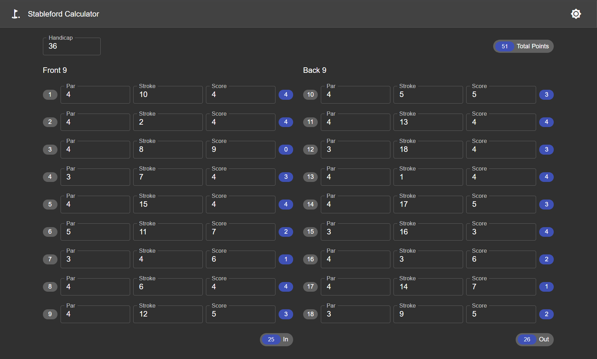
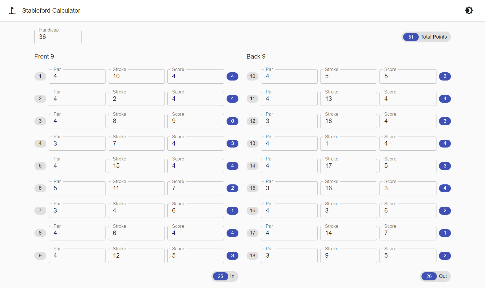

# stableford-calculator

Responsive website for calculating stableford points for your round of golf. Enter your handicap then enter the par, stroke index, and score for each hole. Then points for each hole will then be calculated and added to the total.

Dark Mode:

Light Mode:

